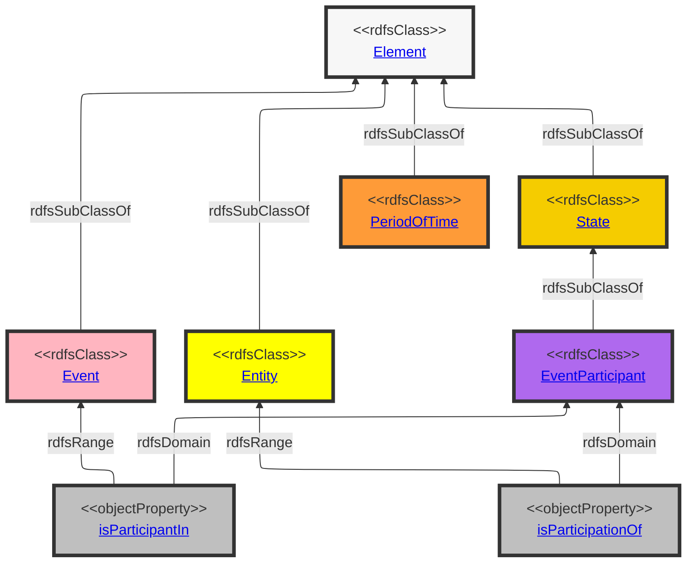

```mermaid

---
config:
    flowchart:
        defaultRenderer: elk
---

graph BT

Element[#60;#60;rdfsClass#62;#62;<br /> <a class='internal-link is-unresolved' href='../../Element'>Element</a> ]
PeriodOfTime[#60;#60;rdfsClass#62;#62;<br /> <a class='internal-link is-unresolved' href='../../PeriodOfTime'>PeriodOfTime</a> ]
State[#60;#60;rdfsClass#62;#62;<br /> <a class='internal-link is-unresolved' href='../../State'>State</a> ]
Event[#60;#60;rdfsClass#62;#62;<br /> <a class='internal-link is-unresolved' href='../../Event'>Event</a> ]
Entity[#60;#60;rdfsClass#62;#62;<br /> <a class='internal-link is-unresolved' href='../../Entity'>Entity</a> ]
EventParticipant[#60;#60;rdfsClass#62;#62;<br /> <a class='internal-link is-unresolved' href='../../EventParticipant'>EventParticipant</a> ]

isParticipantIn[#60;#60;objectProperty#62;#62;<br /> <a class='internal-link is-unresolved' href='../../isParticipantIn'>isParticipantIn</a> ]
isParticipationOf[#60;#60;objectProperty#62;#62;<br /> <a class='internal-link is-unresolved' href='../../isParticipationOf'>isParticipationOf</a> ]

PeriodOfTime--rdfsSubClassOf-->Element
State--rdfsSubClassOf-->Element
Event--rdfsSubClassOf-->Element
Entity--rdfsSubClassOf-->Element
EventParticipant--rdfsSubClassOf-->State


isParticipantIn--rdfsRange-->Event
isParticipantIn--rdfsDomain-->EventParticipant

isParticipationOf--rdfsRange-->Entity
isParticipationOf--rdfsDomain-->EventParticipant


style Element fill:#F7F7F7,stroke:#333,stroke-width:4px;
style Entity fill:#FFFF00,stroke:#333,stroke-width:4px
style State fill:#F5CC00,stroke:#333,stroke-width:4px
style Event fill:#ffb5c0,stroke:#333,stroke-width:4px
style PeriodOfTime fill:#fe9b38,stroke:#333,stroke-width:4px
style EventParticipant fill:#aF69EE,stroke:#333,stroke-width:4px
style isParticipationOf fill:#BFBFBF,stroke:#333,stroke-width:4px
style isParticipantIn fill:#BFBFBF,stroke:#333,stroke-width:4px


```