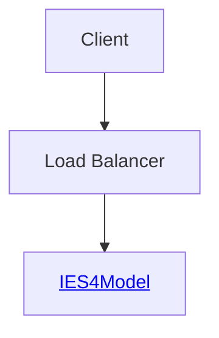

## Relationships

Relationships may exist between Things in IES - and can be used to assert anything from structural to legal connections between things. The concept of a relationship should be familiar to anyone who has looked at data model or ontology before. However, as IES4 is a 4D ontology, the relationships may only apply to a certain phase (state) of the Element - e.g. someone working for an Organisation for a period of time. Unlike attributes, the majority of relationships fall into this category. There are exceptions, such as being the sibling of someone (it's for life for both of them) but it turns out the majority are temporal. Like attributes, we create a State of the Entity instance in question and then attach the relationship to the State. 

In the example below, Fred has always been Barry's sibling and will continue to be whilst they both exist so there is no need for a State. In the second relationship, Fred worked for Acme since 5th December 2011, and is still working there because there is no end date. 

Note: in the example below, Fred still works for Acme. But if Fred had left Acme, and we didn't know when, the end BoundingState should be created to show the Employed state had ended, even though there is no associated PeriodOfTime

<!---

* [Element](#97edc90f-3b36-4da8-ae77-d5fdbdea2b21)
* [isStateOf](#f7cbf87a-6ecc-4c9f-b698-fd3cf3f7980e)
* [relationship](#dce662f5-7bdb-457e-ae7e-2e5fe43dba1a)
* [ResponsibleActor](#d09ede21-e862-4ec1-bc0f-045cce5454a9)
* [Person](#5d5c5b9b-5e90-4100-8353-8ee9f3d772e2)
* [Organisation](#1ecb4c6e-6a30-4dc5-a4ac-9a9df5b6a54f)
* [PeriodOfTime](#3fdfa898-c340-4279-8b3c-275359d5b02d)
* [BoundingState](#892345cd-9fa7-4982-978d-b6d3abae839c)
* [isStartOf](#d9e068b1-2a44-4523-b8fc-f9888212b35c)
* [isPartOf](#cd85d7f7-783b-4d06-b023-56dbbddc02dc)
* [inPeriod](#2f08ef25-a5c8-48ad-85e3-903db008aa19)
* [worksFor](#181aac84-26ce-4531-ac32-a73b8fd8b858)
* [ResponsibleActorState](#100b93cd-937e-4fdd-8851-02d1dc07f5b6)
* [ContinuousState](#6e5af4bb-bb7f-4387-a7bb-476b81fec103)
* [PersonState](#38f8b795-0bce-4945-8c69-8678ed935c1a)
* [familiallyRelatedTo](#3aa26ac6-206d-4b6d-bdec-c9e2b4814be7)
* [siblingOf](#a0d40c4f-b513-4c9f-8d4a-79d0fa7cef50)
* [Actor](#b2b15802-9ce9-4a9d-9de0-8289d8474e9b)
* [ActorState](#7ed8bc7c-a85f-4ed5-ac6f-d640f2df4b7b)
-->