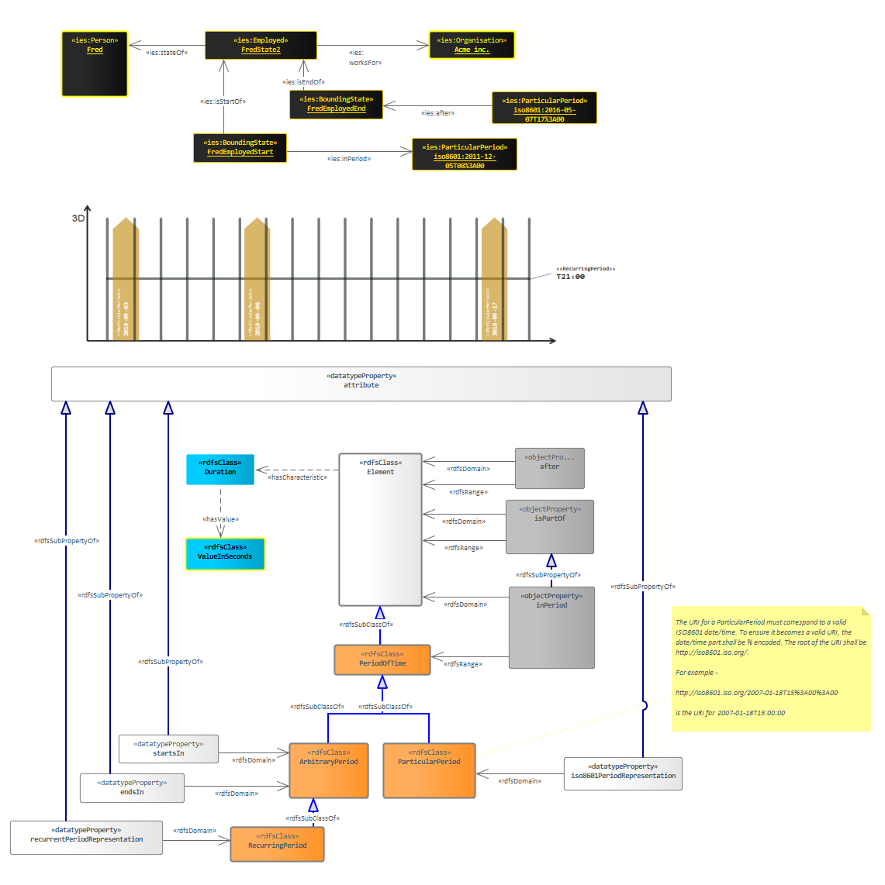

# Welcome to MkDocs

For full documentation visit [mkdocs.org](https://www.mkdocs.org).

## Commands

* `mkdocs new [dir-name]` - Create a new project.
* `mkdocs serve` - Start the live-reloading docs server.
* `mkdocs build` - Build the documentation site.
* `mkdocs -h` - Print help message and exit.

## Project layout

## Period of Time

### IES elements in this diagram:

* [after](#fa4ddf04-16da-4b5c-ae9a-6ab8cd07dcdb)
* [Element](#97edc90f-3b36-4da8-ae77-d5fdbdea2b21)
* [isPartOf](#cd85d7f7-783b-4d06-b023-56dbbddc02dc)
* [inPeriod](#2f08ef25-a5c8-48ad-85e3-903db008aa19)
* [PeriodOfTime](#3fdfa898-c340-4279-8b3c-275359d5b02d)
* [RecurringPeriod](#986e66ac-9092-410b-88ad-30b86efc32dd)
* [ParticularPeriod](#2173f463-524c-457c-b106-51322f64f122)
* [Duration](#7852a5e5-8684-49f2-82ae-3368032163b1)
* [ValueInSeconds](#e485d394-b9d7-40b6-bd44-e5970b2118bd)
* [attribute](#4a8e5877-32df-428f-9a60-6ac3d083ffca)
* [ArbitraryPeriod](#68ba678c-dca8-453e-bfcc-d9fb48339d99)
* [recurrentPeriodRepresentation](#442ac7f0-ae57-4090-88d6-55a3825eceaa)
* [startsIn](#861e3d08-3659-489a-b100-0e943cf3f3f0)
* [endsIn](#6767dfcd-3fcb-42cc-bee3-9fa9a324df0b)
* [iso8601PeriodRepresentation](#e9372543-434e-45d3-a1f0-8d711952d10a)

Periods of time are Elements in a 4D ontology. They can be treated like any other element -e.g.  assembled with isPartOf relationships. This is the big advantage to a 4D ontology - time is treated the same way as space, which allows complex temporal logic information to be expressed using very simple constructs. 

IES also allows a duration to specified even when the precise start and end are not known - e.g. we can specify a meeting lasted an hour and took place on a particular day, but we don't know what time it began and ended.

Note: to prevent duplicate periods being created, the uri of each period should reflect the ISO8601 datetime in Coordinated Universal Time (encoded without punctuation). So for example, the uri for January 2008 would be http://iso8601.iso.org#200801. For ParticularPeriod, this is fairly simple. For PeriodOfTime, the ISO8601 encoding for the period should be used.

In the first example below, we show that Fred began working for Acme in 2011, and that we know he left Acme, and we're not sure of the day he left, but it was before 2016-05-07.

Technically, a PeriodOfTime is all of space, for a specific (or recurring) period (see the second example below; a space-time diagram which has 3 particular days, and a recurring 1 minute period, every day):

